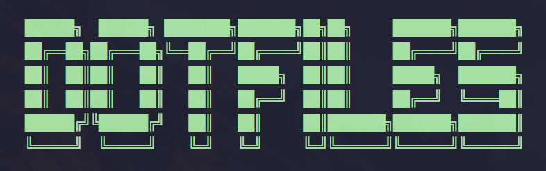
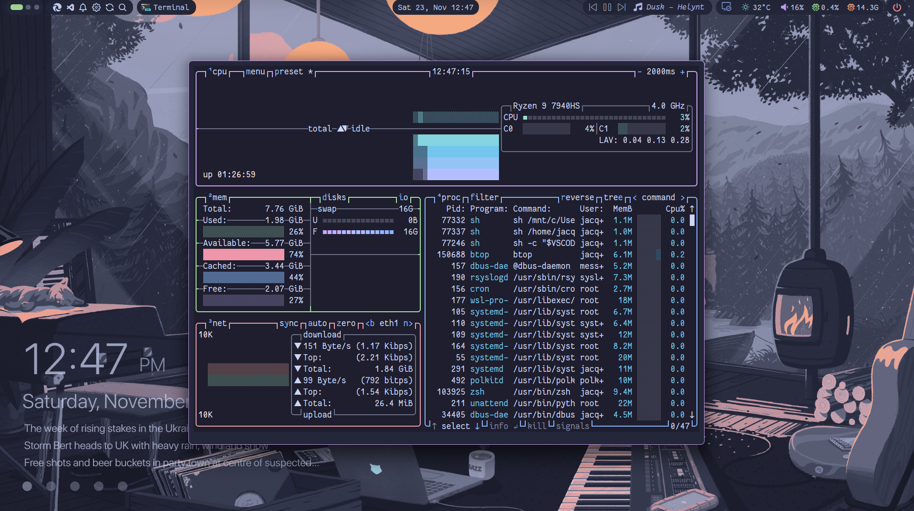
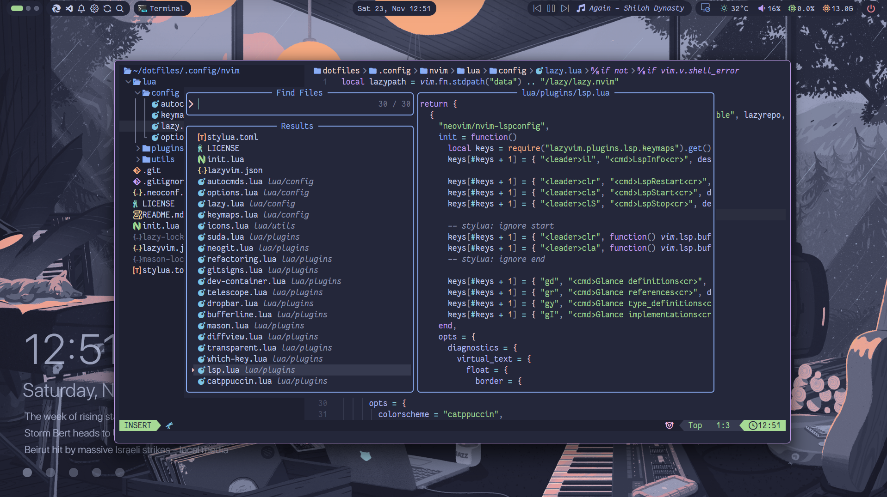
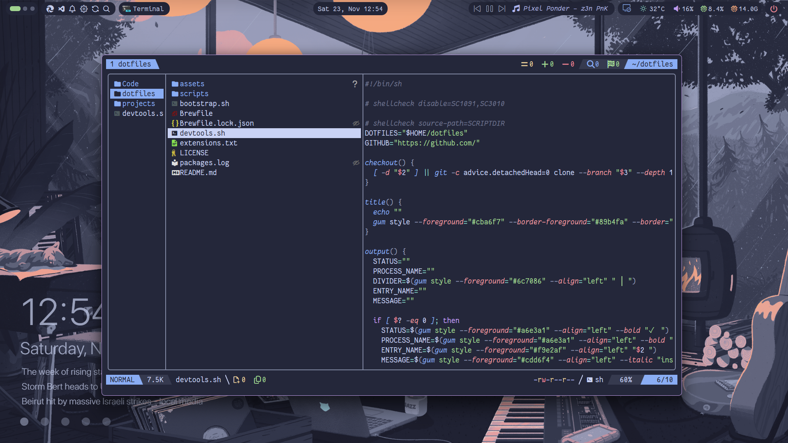

<h3>
<div align="center">


<br>
<br>

🌿 A WSL / Linux Virtual Machine Dotfiles Repo 🌿

</div>
</h3>

<hr>

<div align="center">
<br>
<p>
  <a href="https://skillicons.dev">
  	
  </a>
</p>
<p>
  <a href="https://github.com/jacquindev/commits/main"></a>&nbsp;&nbsp;
  <a href="https://github.com/jacquindev/dotfiles/"></a>&nbsp;&nbsp;
  <a href="https://github.com/jacquindev/dotfiles/stargazers"></a>&nbsp;&nbsp;
  <a href="https://github.com/jacquindev/dotfiles/LICENSE"></a>&nbsp;&nbsp;
</p>
</div>

> [!NOTE]
> Windows 11 Dotfiles Repository is maintained here ⇒ **[windots](https://github.com/jacquindev/windots.git)**

<br>
<br>

## 🖥️ Demo

https://github.com/user-attachments/assets/e638f52a-899a-4b30-91b8-536e555cf5b6

https://github.com/user-attachments/assets/ddc7f78b-71a4-40a3-8714-1f0d83e0eb28

<br>

## 🌼 Preview







<br>

## 🔧 Setup

This repository is meant to use with my **[ansible automated repo](https://github.com/jacquindev/automated-devops-wsl2)**

### No-Ansible

- Clone this repo locally

```bash
git clone https://github.com/jacquindev/dotfiles.git ~/.dotfiles
```

```bash
cd ~/.dotfiles && stow .
```
