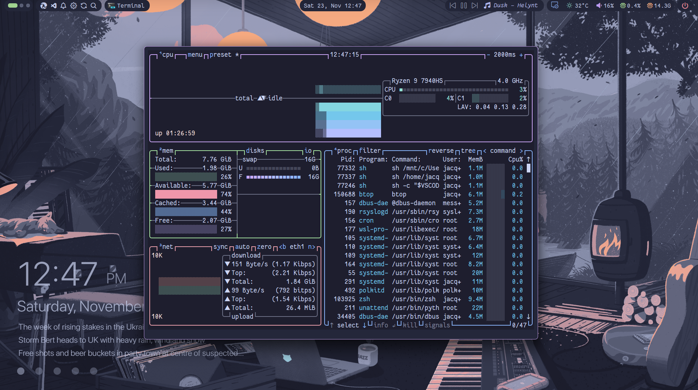
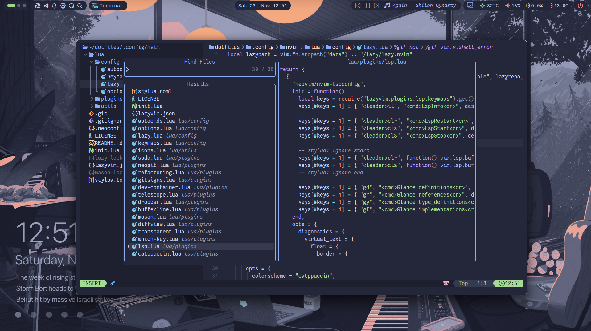
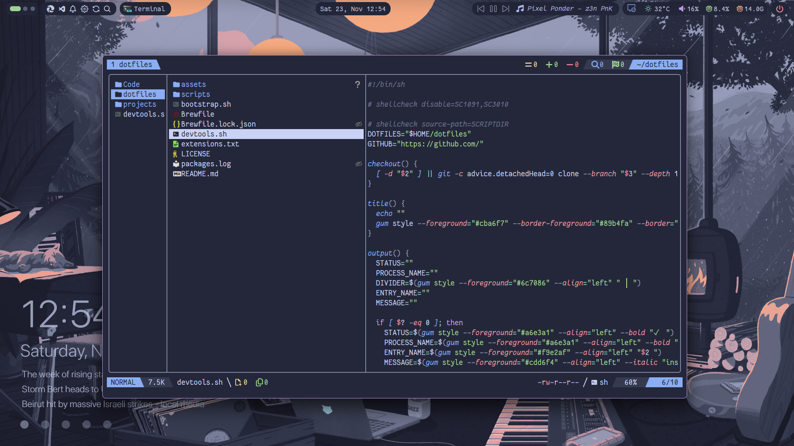

<h3>
<div align="center">


<br/>
<br/>

🌿 A WSL (Ubuntu/Debian) Dotfiles 🌿

</div>
</h3>

<hr/>

<div align="center">
<p>
  <a href="https://github.com/jacquindev/commits/main"></a>&nbsp;&nbsp;
  <a href="https://github.com/jacquindev/dotfiles/"></a>&nbsp;&nbsp;
  <a href="https://github.com/jacquindev/dotfiles/stargazers"></a>&nbsp;&nbsp;
  <a href="https://github.com/jacquindev/dotfiles/LICENSE"></a>&nbsp;&nbsp;
</p>  
</div>

> [!NOTE]
> Windows 11 Dotfiles Repository is maintained here ⇒ **[windots](https://github.com/jacquindev/windots.git)**

<br/>

## 🖥️ Demo

https://github.com/user-attachments/assets/e638f52a-899a-4b30-91b8-536e555cf5b6

https://github.com/user-attachments/assets/ddc7f78b-71a4-40a3-8714-1f0d83e0eb28

<br/>

## 🌼 Preview







<br/>

## 🔧 Setup

> [!WARNING]<br>
> For **BEST** result, please run: `sudo visudo` <br>
> Then add the following line at the **end** of the file: <br> > _(This will disable password prompt of `sudo` command)_
>
> ```bash
> your_username ALL=(ALL) NOPASSWD:ALL
> ```

<hr/>

1. **Install the Prerequisites**

   ```bash
   # Update system
   sudo apt update && sudo apt upgrade -y

   # Prerequisites packages
   sudo apt install -y curl file git lsb-release
   ```

2. **Clone this Repository**

   ```bash
   git clone https://github.com/jacquindev/dotfiles.git ~/dotfiles
   cd ~/dotfiles

   # Update submodules in the repository
   git submodule update --init --recursive
   ```

3. **Run [Setup Script](./bootstrap.sh)**

   ```bash
   . ./bootstrap.sh
   ```

4. **Set ZSH Default Shell** _(recommended)_

   ```bash
   chsh -s "$(which zsh)" "$USER"
   ```

5. **[Dev Tools Installation](./devtools.sh)** _(optional)_

   ```bash
   . ./devtools.sh
   ```
