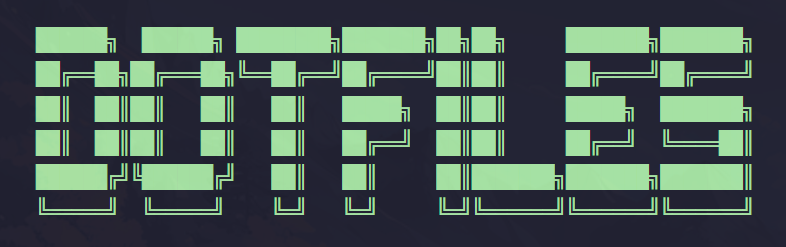

<h3>
<div align="center">


<br/>

🌿 A WSL/Linux Machine Dotfiles 🌿

</div>
</h3>

<hr/>

<div align="center">
<p>
  <a href="https://github.com/jacquindev/commits/main"></a>&nbsp;&nbsp;
  <a href="https://github.com/jacquindev/dotfiles/"></a>&nbsp;&nbsp;
  <a href="https://github.com/jacquindev/dotfiles/stargazers"></a>&nbsp;&nbsp;
  <a href="https://github.com/jacquindev/dotfiles/LICENSE"></a>&nbsp;&nbsp;
</p>  
</div>

> [!NOTE]
> For Windows 11 Dotfiles Repo is maintained here -> [windots](https://github.com/jacquindev/windots.git)

<div align="center">
  <a href="#-setup"><kbd> <br> 🔧 Setup <br> </kbd></a>&ensp;&ensp;
</div>

<br>

## 🔧 Setup

1. **Clone this repository**

   ```bash
   git clone https://github.com/jacquindev/dotfiles.git
   cd dotfiles
   ```

2. **Run setup script**

   ```bash
   . ./bootstrap.sh
   ```
